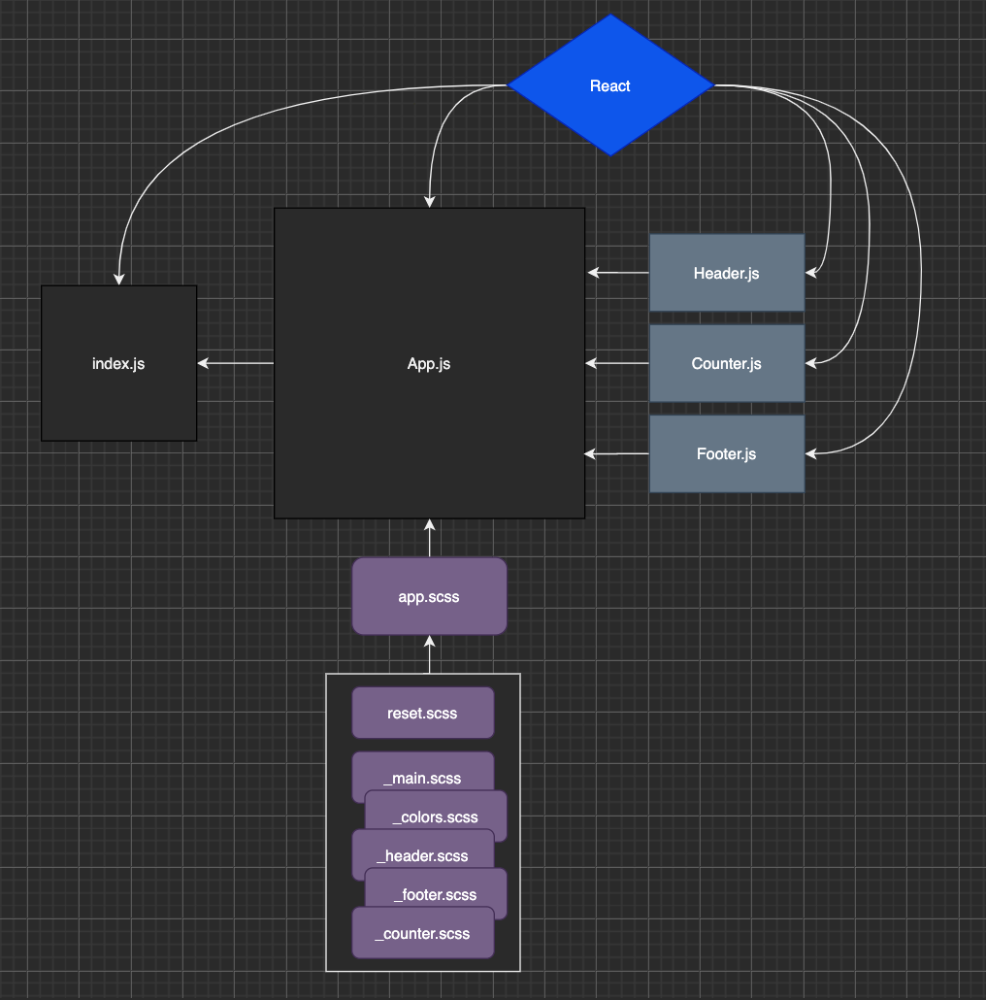

# Lab 22
Repo for seattle-js-401n16 lab 22  
### Author: Clayton Jones

## [Pull Request](https://github.com/claytonjones-401n16/lab-22/pull/4)

## Deployed Sites
[Netlify](https://flamboyant-jones-785717.netlify.app/) - 
[AWS S3](http://401n16-lab-22.s3-website-us-west-1.amazonaws.com/) - 
[AWS Amplify](https://master.difc8z08gc84d.amplifyapp.com/)  
  
## How to use
Follow any of the links above, and click the `+` and `-` on the page to use the counter.

## UML

